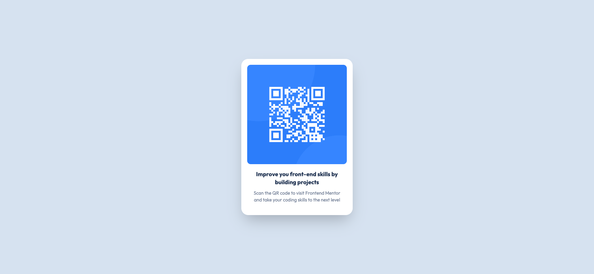

# Frontend Mentor - QR code component

# Frontend Mentor - QR code component solution

This is a solution to the [QR code component challenge on Frontend Mentor](https://www.frontendmentor.io/challenges/qr-code-component-iux_sIO_H). Frontend Mentor challenges help you improve your coding skills by building realistic projects.

### Screenshot

### Links

- Live Site URL: [Add live site URL here](https://challenge-qr-code-component.vercel.app/)

## My process

### Built with

- Vue 3
- Tailwindcss
- Vite
- Vercel (Free Hosting)
